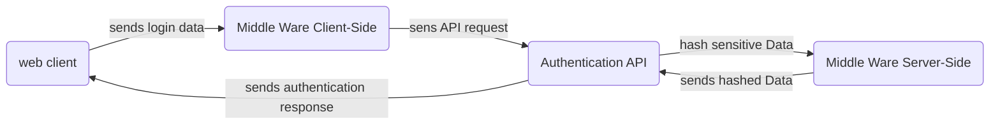

# Documentation du projet

----

> réalisé par Lucas Simpol Augeray et Alexis Opolka.

## Présentation du projet

Dans le cadre de la SAE-23, nous avons du réalisé une application web avec divers fonctionnalités tel qu'un service d'authentification, une base de donnée, une gestion des utilisateurs, etc.  
Pour cette SAE-23 nous avons donc décidé de réaliser une application web afin de pourvoir consulter des différents donnée récupéré par différent capteur (température, humidité, etc.) et de pouvoir les afficher sur une page web. cette application web est donc composé d'un serveur web, d'une base de donnée et d'un client web.  
Ce projet a été réalisé en partie de manière à pouvoir être réutilisé par Alexis Opolka dans le cadre de son projet **entrepreneurial**.

## Présentation de l'application

Comme indiquée dans la présentation du projet, notre application est composée de différents éléments:

- [une base de donnée](#la-base-de-donnée)
- [un service d'authentification](#le-service-d'authentification)
- [un client web](#le-client-web)

### La base de donnée

La base de donnée est hébergée *localement*, ce qui nous permet de 
faire fonctionner notre application sans avoir besoin de recourir
à une connexion externe à la machine.  
Elle est basée sur le système de base de donnée **MySQL**.  
Cette base de donnée nous permet de stocker différentes données
tel que les utilisateurs, les données des capteurs, etc.
Notre application ayant pour but de consulter beaucoup de données,
et d'utiliser une BD relationnelle, nous avons donc décidé de 
stocker les données des capteurs dans des fichiers JSON, ce qui
nous permet de pouvoir réduire la charge sur le SGBD et donc
le temps de traitement des requêtes SQL, amenant ainsi à une
augmentation de la vitesse de chargement de notre application.

Au niveau des différent requêtes que la page web fait à la base de donnée, nous avons :

- une requête pour récupérer les données (des capteurs)
- une requête pour récupérer les utilisateurs

Les différentes données récupérées sont affichées sous la forme
d'un graphique afin de pouvoir les consulter facilement et pouvoir
 les comparer entre elle sur une longue période de temps.

On se retrouve donc avec un schéma relationnel de la base de donnée suivant :

```mermaid

---
title: Schéma relationnel de la BD MySQL de l'application Mon-Banzaii
---

classDiagram
    namespace authentication
        class User {
            int id
            String username
            String FirstName
            String LastName
            String email
            String hash
            String admin
            Boolean deleted
        }
    namespace data

        %% Let's set the interactions between the objects
        Banzaii <-- internal_data: Banzaii.id_donnee_interne -> internal_data.id
        Banzaii <-- external_data: Banzaii.id_donnee_externe -> external_data.id

        class Banzaii {
            int id
            int id_donnee_interne
            int id_donnee_externe
            String localisation
        }
        class internal_data {
            int id
            String path
            timestamp created
            timestamp updated
        }
        class external_data {
            int id
            String path
            timestamp created
            timestamp updated
        }
        class sensor_list {
            int id
            String nom_capteur
            String fonction_capteur
        }
```

### Le service d'authentification

Le service d'authentification est utilisé pour les utilisateurs,
on utilise toujours la base de données MySQL.  
Il est inspiré de l'exemple en Javascript de [Jason Watmore](https://github.com/cornflourblue/next-js-13-mysql-registration-login-example),
notamment sur l'interaction Serveur / Client.  
Il a, bien entendu, fallu adapter le typage et ajouter des spécifications
à différents endroits.

De part le temps restreint, le système d'authentification est à un
seul facteur (FA), le mieux aurait été d'implémenter une solution
de double authentification (2FA) via des solutions OTP ou par
SMS.

De fait l'utilisation de NextJS, on va parler de routes.  
Nous avons deux catégories de routes:

- les routes publiques
- les routes sécurisées

Les routes publiques sont les routes qui n'ont pas besoin
d'authentification afin de pouvoir afficher du contenu.

Elles sont définies dans la fonction `authCheck()` présente dans
le fichier de configuration [`_app.tsx`](/mon-banzaii-app/pages/_app.tsx)

```ts
const publicPaths = ['/users/account/login', '/users/account/register', '/'];
```

Toutes les autres routes sont donc traitées comme des routes sécurisées,
elles nécessitent d'être authentifiés auprès de la base de données afin
de pouvoir y accéder.

Le système de droits a été simplifié à une seule variable, `admin`,
si la variable est à **true**, l'utilisateur est un administrateur,
sinon l'utilisateur est un simple utilisateur.  
La variable est par défaut à **false**.  
Vu que l'on utilise une application au principe d'un site unipage,
on met à défaut la variable mais dans la page du profile, si
l'utilisateur à l'identifiant égal à 1 (Première entrée dans la table),
on lui permet une élévation de droits.

> **Note**:  
> L'aspect sécurité serait à vérifier du fait de la présence
> de la fonction appelant à l'élévation de droits présente
> dans les fichiers du client.

Un schéma simplifié du système serait:



### Le client web

les différent page de notre applicationt sont codé en **typescript** et sont donc compilé en **javascript** avec le paquet nodejs afin de pouvoir être executé par le navigateur. Tout les page sont tout liée entre elle ce qui nous permet de pouvoir mettre en place un système d'authentification basé sur les **cookies**.  
Au niveau des différente page nous avons donc :

- une page d'accueil

    Sur la page d'accueil nous avons donc un bouton pour se connecter et un bouton pour s'inscrire situé en haut a droite, ces deux bouton nous redirige vers les page correspondante, au centre de la page nous avons le logo de notre application et en haut a droite nous avons aussi le logo de notre application qui nous redirige vers la page d'accueil si on clie dessus. Un fois connecté, le haut des page est modifier afin d'ajout le bouton 'déconnexion' mais aussi a la page de gestion des utilisateurs en cliquent sur l'image de profil en haut a droite nous pouvons accéder a la page de gestion des utilisateurs.  

- une page de connexion

    Sur la page de connexion nous avons donc un formulaire de connexion qui nous permet de nous connecter a notre compte, si on a pas de compte on peut cliquer sur le bouton 's'inscrire' qui nous redirige vers la page d'inscription.  

- une page d'inscription

    Sur la page d'inscription nous avons donc un formulaire d'inscription qui nous permet de nous inscrire a notre application, si on a déjà un compte on peut cliquer sur le bouton 'se connecter' qui nous redirige vers la page de connexion. Pour des raison de sécurité nous avons décidé de ne pas stocker les mot de passe en clair dans la base de donnée, nous avons donc décidé de les hasher avec l'algorithme **???** et aussi tout les mots de passe sont soumie a des restriction.  

- une page de gestion des utilisateurs

    Sur la page de gestion des utilisateurs nous avons donc un tableau qui nous permet de voir tout les utilisateur de notre application, nous pouvons aussi les supprimer ou les modifier. Pour des raison de sécurité nous avons décidé de ne pas afficher le mot de passe d'un utilisateur, dans le cas ou l'on supprime un utilisateur, nous changeons un paramètre dans la base de donnée qui nous permet de savoir si l'utilisateur est supprimé ou non, cela nous permet de pouvoir le réactiver si besoin.  


- une page de gestion des données

    Sur la page de gestion des données nous affichons donc les différente donnée récupéré par les capteurs, nous pouvons donc les consulter sous la forme d'un graphique, chaque grafique affiche donc une donnée différente.

----

## Copyright &copy; Lucas Simpol Augeray, Alexis Opolka 2023 - All Rights Reserved
